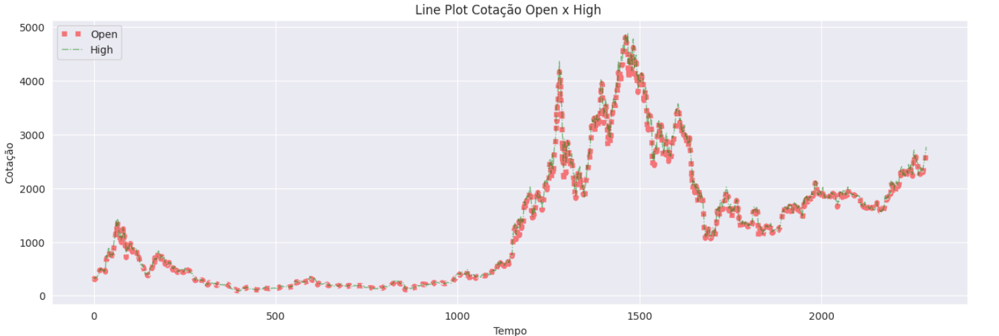
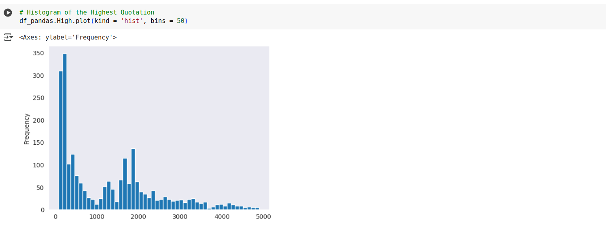
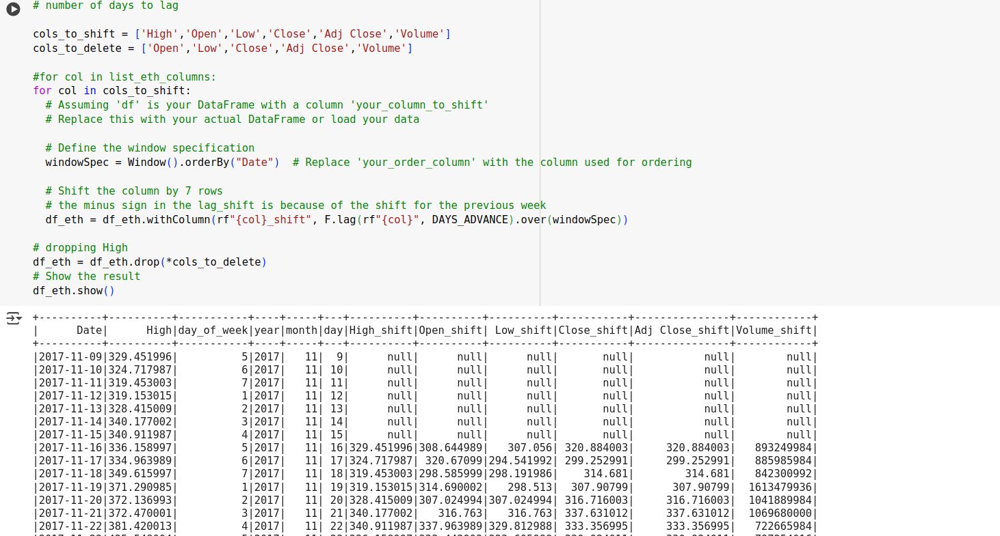
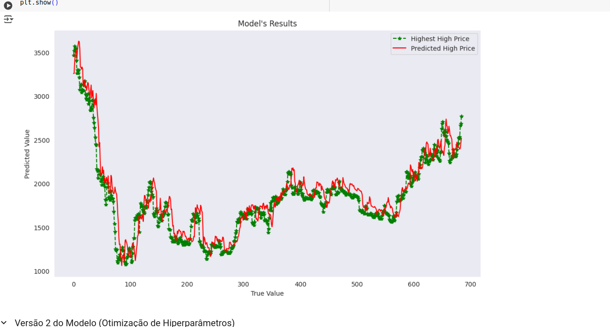
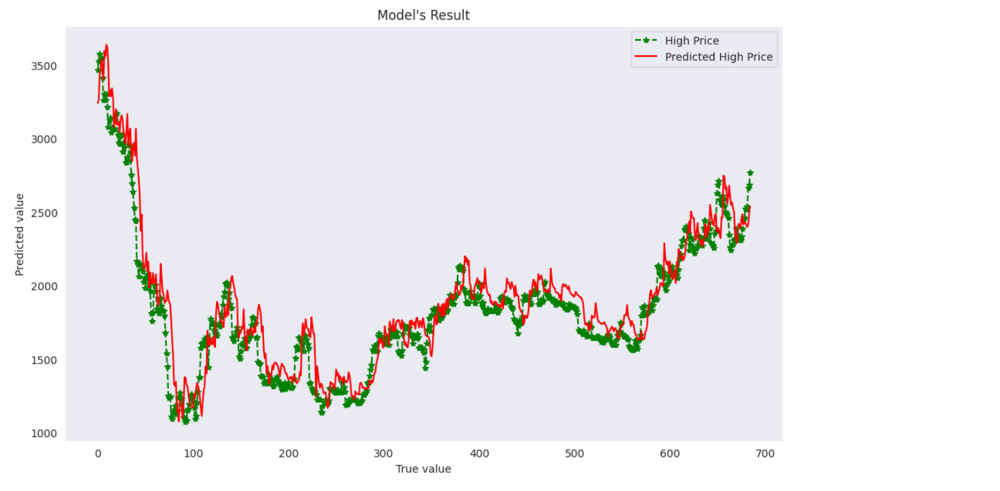
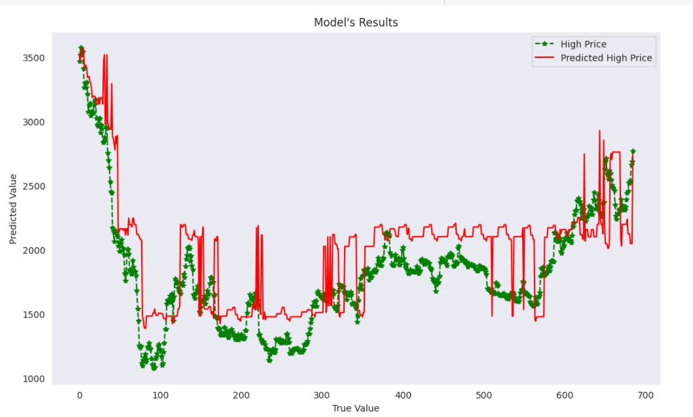

# Personal Portfolio Project: Predicting Ethereum's coin price

### SnapShot 1: Open and High Prices
The snapshot below shows in graphical form open and high prices for the period of 2017 to 2023.
We can notice that the time-series data pattern is complex for modeling in the long-term. 

### SnapShot 2: Histogram of High Prices

The snapshot below shows an histogram of the High Prices of Ethereum, showing that its values is mainly concentrated in the range 0 up to 1000, followed by a soft increase from 1000 up to 3000. 

### SnapShot 3: Dataset Feature Engineering
The screenshot below shows the feature Engineering procedure performed in the dataset, dropping highly correlated features with the target (**High**), and creating lagged features in order to forecast the Ethereum's coin price with one week of advance. 

### SnapShot 4: First Regression ML model

The data was date-sorted and a **Linear Regression** was fitted in the data, showing the results displayed in the screenshot below.
The **R2** score was found as to be 0.867, which demonstrates a good fit to the test data, and then a good generalization capability.
Noticeably, we observed that when the days in advance to forecast the Ethereum's price is increased, the R2 score on the test data rapidly diminishes.

### SnapShot 5: Regression ML modeling by using Regularization and Cross-Validation

The screenshot below shows the prediction for the best Linear Regression with Regularization and hyperparameter tuning and the test ground-truth, evidencing a good result, possessing a R2 score similar to the previous one.

### SnapShot 1: Gradient Boosted Tree modeling Results

In order to try to obtain a better performance in the test set, more complex models have been trained.
However, they performed poorly on the test data, as shown in the screenshot below for the Gradient Boosting Regressor, clearly presenting overfitting.

